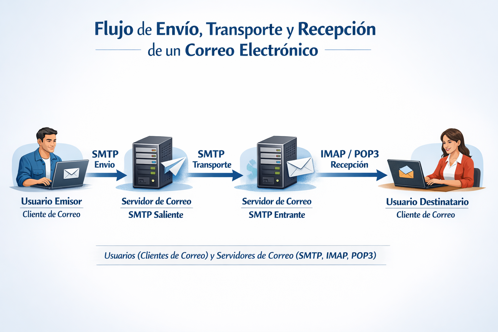
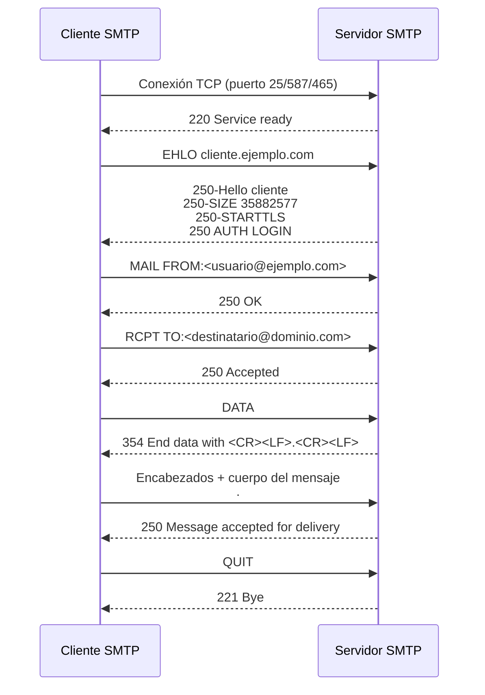

# Servicios de red

Cuando hablamos de servicios de red nos referimos a las distintas aplicaciones que implementan protocolos como SSH, SMTP, DNS, Telnet, FTP, etc. asociados a los respectivos servicios de conexiones seguras, correo electrónico, resolución de nombres, etc. Estos servicios se encuentran en toda la red y proporcionan acceso interactivo remoto, transferencia de archivos y funciones críticas de administración para el funcionamiento de distintos sistemas.

En este tema vamos a ver dos de estos servicios de red:

* El servicio correo electrónico a través del protocolo SMTP. Enviaremos correos utilizando este protocolo y distintas librerías y servicios.
* El servicio web, mediante el protocolo HTTP, este último en el contexto de la creación de una API RESTful utilizando el framework GIN.

## Correo electrónico SMTP - Envío de emails

SMTP (Simple Mail Transfer Protocol) es un protocolo de comunicación utilizado para el intercambio de mensajes de correo electrónico entre distintos dispositivos a través de Internet. Este protocolo está construído sobre TCP, protocolo de la capa de transporte, y se encuadra a su vez en la capa de aplicación.

Este protocolo, debido a sus limitaciones, se encarga de la tarea de enviar correos entre el cliente y el servidor de correo y entre servidores, mientas que otros protocolos como IMAP (Internet Message Access Protocol) o POP3 (Post Office Protocol version 3) se encargan de la tarea de recibir y descargar los correos electrónicos desde el servidor al cliente.

Como el resto de protocolos que veremos en esta unidad, usa por debajo el protocolo de transporte TCP, concretamente el puerto 25 para la comunicación entre servidores de correo y el puerto 587 para la comunicación entre clientes de correo y servidores de correo.

Este protocolo usa un modelo de comunicación cliente-servidor, donde el cliente de correo (como Outlook, Thunderbird o una aplicación personalizada) se conecta al servidor de correo (como Gmail, Yahoo Mail o un servidor de correo empresarial) para enviar mensajes. El proceso de envío de correo electrónico a través de SMTP implica varios pasos, como la autenticación del cliente, la construcción del mensaje, la transmisión del mensaje al servidor y la entrega del mensaje al destinatario.

### Comunicación SMTP

En el siguiente gráfico se muestra un ejemplo del uso del protocolo SMTP y su relación con IMAP y POP3 para el envío y recepción de correos electrónicos:

En el gráfico (_generado por copilot/dall-e_) se pueden observar los siguientes procesos:

- **Generación y Envío (SMTP)**: El proceso comienza cuando el remitente redacta el mensaje en su programa cliente y lo envía. Para esta fase de salida desde el cliente hacia el servidor de correo saliente, **se utiliza el protocolo SMTP**.
- **Transmisión entre Servidores (SMTP)**: El servidor del remitente localiza el servidor del destinatario a través de Internet y le transfiere el mensaje. Esta comunicación de servidor a servidor también se realiza mediante SMTP.
- **Recepción y Almacenamiento**: El servidor del destinatario recibe el correo y lo guarda en el buzón correspondiente.
- **Descarga por el Destinatario (IMAP/POP3)**: Finalmente, el destinatario abre su programa cliente para leer el mensaje. Para descargar o sincronizar el correo desde el servidor, se utilizan los protocolos IMAP (que mantiene los correos sincronizados en el servidor) o POP3 (que suele descargarlos y eliminarlos del servidor).

La comunicación ente dos servidores de correo a través de SMTP se realiza mediante una serie de comandos y respuestas que permiten la transferencia de mensajes entre un cliente y un servidor (o entre dos servidores). Estos comandos son las "instrucciones" que indican qué acción se debe realizar en cada paso del envío.

Recordemos que esto realmente se realiza a través de una conexión TCP establecida entre el cliente y el servidor, y cada comando se envía como una línea de texto seguida de un retorno de carro y un salto de línea (CRLF). El servidor responde a cada comando con un código de estado que indica si la operación fue exitosa o si hubo algún error. Todo, últimamente, se reduce a establecer una conexión TCP y el intercambio de secuencias de comandos y respuestas en forma de secuencias de bytes.

Algunos de los comandos SMTP más comunes incluyen:

| Comando SMTP | Función Principal                                                                                                                                                                                   |
| ------------ | --------------------------------------------------------------------------------------------------------------------------------------------------------------------------------------------------- |
| HELO / EHLO  | Inicia la sesión.Es el "hola" del cliente para presentarse al servidor.  EHLO (Extended HELO) es la versión moderna que informa al servidor que el cliente soporta extensiones adicionales (ESMTP). |
| MAIL FROM:   | Inicia formalmente la transacción del mensaje.  Especifica la dirección de correo electrónico del remitente (quién envía el correo).                                                                 |
| RCPT TO:     | Especifica la dirección de correo electrónico del destinatario.  Si el correo va dirigido a varias personas, este comando se envía varias veces, una por cada destinatario.                          |
| DATA         | Indica al servidor que los datos que vienen a continuación son el contenido real del mensaje.  Las cabeceras como "Asunto" o "Fecha", y el cuerpo del correo.                                       |
| QUIT         | Pide al servidor que cierre la conexión.  Finaliza la sesión SMTP de forma ordenada una vez que los correos han sido enviados.                                                                       |

Un ejemplo de comunicación SMTP entre un cliente y un servidor podría ser el siguiente:

#### Puertos de SMTP

Los puertos que se utilizan para la comunicación SMTP son cuatro, cada uno asociado a un tipo de cifrado diferente para el envío de correos electrónicos:

- 25: Este puerto se utiliza para la comunicación entre servidores de correo, y es el puerto estándar para el envío de correos electrónicos. Sin embargo, debido a que no requiere cifrado, muchos proveedores de servicios de Internet bloquean este puerto para evitar el envío de correos electrónicos no deseados o maliciosos.
- 2525: Este puerto es una alternativa al puerto 25 pero, diferencia de éste, el puerto 2525 puede ser cifrado utilizando TLS (Transport Layer Security), lo que proporciona una capa adicional de seguridad para la transmisión de correos electrónicos.
- 587: Este puerto es el puerto registrado por la IANA (Internet Assigned Numbers Authority) como el puerto seguro para SMTP. Requiere una conexión TLS explícita, lo que significa que el cliente debe iniciar la conexión y luego negociar el cifrado con el servidor. Sin embargo, si el servidor no admite TLS, el mensaje se enviará en texto plano, lo que representa, de nuevo, un riesgo de seguridad.
- 465: Este puerto se utiliza para SMTP sobre SSL (Secure Sockets Layer) de forma implícita. Esto significa que la conexión se establece directamente con SSL, y si el servidor no admite esta configuración, la operación se abortará.

Terminamos aqui con los aspectos teóricos relacionados con el protocolo SMTP y el envío de correos electrónicos. Veremos ejemplos prácticos utilizando distintas librerías y servicios para enviar correos electrónicos en la parte práctica de esta unidad.

## Servicios HTTP

El siguiente servicio que veremos será el servicio basado en el protocolo HTTP (Hypertext Transfer Protocol). Nos referimos a los servicios web, que son aplicaciones que se ejecutan en un servidor y que pueden ser accedidos a través de la red utilizando el protocolo HTTP. Este protocolo ofrece un mecanismo para la comunicación entre clientes y servidores en la web, permitiendo la transferencia de datos y la interacción con recursos a través de URLs (Uniform Resource Locators). HTTP es un protocolo de texto plano que se basa en un modelo de solicitud-respuesta (_HTTP requests_ y _HTTP responses_), donde los clientes envían solicitudes al servidor y el servidor responde con los datos solicitados o con información sobre el resultado de la solicitud. HTTP se encuentra en la capa de aplicación y se implementa (al igual que SMTP) sobre el protocolo de transporte TCP, utilizando el puerto 80 para HTTP y el puerto 443 para HTTPS (HTTP seguro con cifrado SSL/TLS).

Cuando hablamos de que se trata de que sigue el modelo cliente-servidor, nos referimos a que el cliente (como un navegador web o una aplicación móvil) realiza solicitudes HTTP al servidor (que aloja la aplicación web o API) para acceder a recursos. Algunos ejemplos de clientes serían un navegador web que accede a una página web, una aplicación móvil que consume una API RESTful o un programa de línea de comandos que interactúa con un servicio web como **curl**. Algunos ejemplos de servidores serían un servidor web como Apache o Nginx que aloja un sitio web, un servidor de aplicaciones que ejecuta una API RESTful o un servidor de correo electrónico que proporciona acceso a través de HTTP.

### API REST

Empecemos por aclarar en que consiste una API. Una API (Application Programming Interface) es un conjunto de reglas y protocolos que permiten a diferentes aplicaciones o sistemas comunicarse entre sí. En el contexto de los servicios web, una API define **cómo los clientes pueden interactuar con un servidor** para acceder a recursos o **realizar acciones** específicas. Las API pueden ser utilizadas para exponer funcionalidades de una aplicación a otros desarrolladores, permitiendo la integración de servicios y la creación de aplicaciones más complejas.

A su vez, una API REST (Representational State Transfer) es un tipo de API que sigue los principios de REST. REST se basa en principios como la separación de recursos, la utilización de métodos HTTP y la representación de recursos en formatos como JSON o XML.

#### Principios de REST

Los principios fundamentales que debe cumplir una API RESTful son los siguientes:

1. _Resource-Based_: En REST, los recursos (también vistos como objetos) son los elementos clave. Cada recurso se identifica mediante una URL única y se representa en un formato específico (como JSON o XML). Por ejemplo, en una API de gestión de usuarios, un recurso podría ser un usuario específico identificado por su ID, como `https://api.com/usuarios/123`.
2. _State-Less_: Las API RESTful son sin estado, lo que significa que cada el servidor no guarda en memoria las peticiones anteriores de un cliente. La solicitud del cliente al servidor debe contener toda la información necesaria para entender y procesar la solicitud. El servidor no debe almacenar ningún estado de la sesión entre solicitudes. Esto permite que las API RESTful sean escalables y fáciles de mantener.
3. Uso de métodos HTTP: REST utiliza los métodos HTTP para realizar operaciones sobre los recursos. Estos métodos implementan el conjunto de operaciones CRUD (Create, Read, Update, Delete) que permiten crear, leer, actualizar y eliminar recursos. Cada método HTTP tiene un propósito específico y se utiliza para realizar una acción particular sobre un recurso
. Los métodos más comunes son:
   - `GET`: Se utiliza para recuperar información de un recurso.
   - `POST`: Se utiliza para crear un nuevo recurso.
   - `PUT`: Se utiliza para actualizar un recurso existente.
   - `DELETE`: Se utiliza para eliminar un recurso.
4. Representación de recursos: Como mencionamos en el punto 1, los recursos en una API RESTful se representan en formatos como JSON o XML. Esto permite que los clientes puedan interpretar y utilizar los datos de manera eficiente. Por ejemplo, una respuesta a una solicitud `GET` para un recurso de usuario podría devolver un objeto JSON con la información del usuario, como su nombre, correo electrónico y fecha de creación. El cliente será el encargado de interpretar esta representación y utilizarla según sus necesidades (crear un objeto en memoria, mostrar la información al usuario, etc.).

> **REST vs RESTful**:
> Rest hace referencia a un estilo de arquitectura de software para diseñar servicios web (los cuatro principios que acabamos de ver), mientras que RESTful se refiere a una API que sigue los principios de REST (la implementación). En otras palabras, REST es el conjunto de principios y RESTful es la implementación concreta de esos principios en una API.

### API RESTful

Una API (Application Programming Interface) RESTful es un tipo de API que sigue los principios de REST (Representational State Transfer).

Para utilizar una API RESTful, los clientes realizan solicitudes HTTP a un servidor que expone la API (_http requests_), y el servidor responde con los datos solicitados (_http responses_) o realiza las acciones correspondientes. Dependiendo del método HTTP (`GET`, `POST`, `DELETE`, `PUT`, etc.) y la URL de la solicitud (el campo _target_ de la primera línea de una petición http), el servidor puede realizar diferentes operaciones sobre los recursos que maneja la API.

La API responderá mediante un HTTP response que incluirá un código de estado HTTP (como 200 OK, 404 Not Found, 500 Internal Server Error, etc.) y, en caso de éxito, el cuerpo de la respuesta contendrá los datos solicitados o una confirmación de la acción realizada, generalmente en formato JSON o XML.

Aquí finalizamos con la parte teórica relacionada con el protocolo HTTP y los servicios web, así como con las API RESTful. En la parte práctica de esta unidad veremos cómo crear una API RESTful utilizando el framework GIN en Go, y cómo consumir esta API desde un cliente HTTP utilizando distintas herramientas y librerías.
